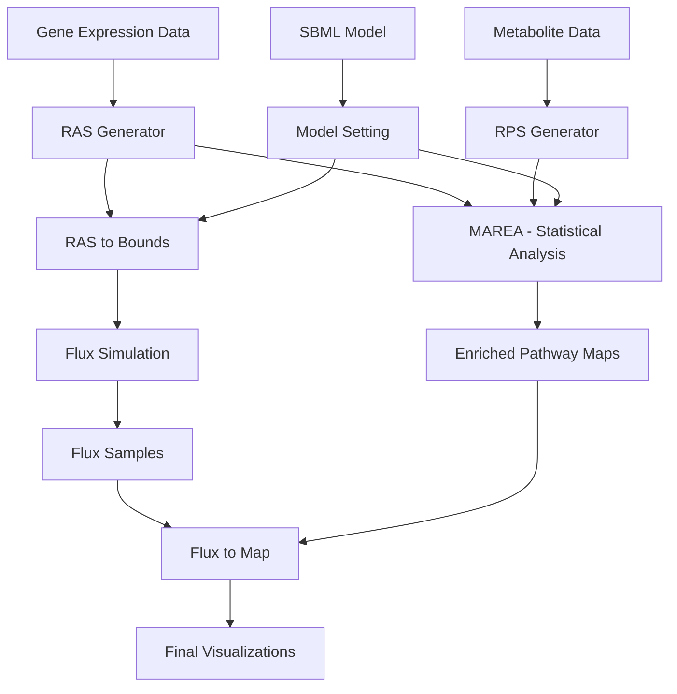

# COBRAxy Documentation

> A Python toolkit for metabolic flux analysis and visualization, with Galaxy integration.

COBRAxy transforms gene expression and metabolite data into meaningful metabolic insights through flux sampling and interactive pathway maps.

## Overview

COBRAxy provides a complete pipeline for metabolic modeling and analysis, from raw omics data to publication-ready pathway visualizations. Whether you're a researcher analyzing metabolic changes in disease, a systems biologist studying metabolic networks, or a bioinformatician building analysis pipelines, COBRAxy offers the tools you need.

## Key Features

- **🧬 Reaction Activity Scores (RAS)** - Compute metabolic activity from gene expression data
- **⚗️ Reaction Propensity Scores (RPS)** - Infer metabolic preferences from metabolite abundance
- **📊 Flux Sampling** - Sample metabolic flux distributions with CBS or OptGP algorithms  
- **📈 Statistical Analysis** - Perform pFBA, FVA, and sensitivity analysis
- **🎨 Interactive Maps** - Generate publication-ready pathway visualizations with SVG/PDF export
- **🌐 Galaxy Tools** - Web-based analysis with intuitive interface
- **🔧 Built-in Models** - Ready-to-use models including ENGRO2 and Recon

## Quick Navigation

### 🚀 [Installation](installation.md)
Install COBRAxy and get it running on your system

### 📚 [Tutorials](tutorials/)
Step-by-step guides for Galaxy and Python usage

### 🛠️ [Tools Documentation](tools/)
Complete reference for all COBRAxy tools

## Workflow Overview

## Data Flow

COBRAxy follows two parallel analysis paths:

1. **Enrichment Analysis**: RAS + RPS → MAREA → Enriched Maps
2. **Flux Simulation**: RAS → Model Constraints → Flux Sampling → Flux Maps

## Community & Support

- **📖 Documentation**: Complete guides and API reference
- **💬 Discussions**: Ask questions and share experiences
- **🐛 Issues**: Report bugs and request features
- **🤝 Contributing**: Help improve COBRAxy

## Quick Links

| Resource | Description |
|----------|-------------|
| [Installation Guide](installation.md) | Get COBRAxy running on your system |
| [Galaxy Tutorial](tutorials/galaxy-setup.md) | Web-based analysis setup |
| [Python Tutorial](tutorials/python-api.md) | Use COBRAxy programmatically |
| [Tools Documentation](tools/) | Complete tool reference |

---

**Ready to start?** Follow the [Installation Guide](installation.md) to get COBRAxy up and running!